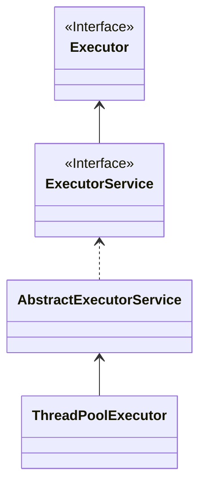

# JUC 并发编程

JUC 就是 `java.util.concurrent` 这个包的简写，concurrent 是同时的意思，也就是并发。

## 创建线程

继承 thread， 无法得到返回值

实现 Runable， 无法得到返回值

Callable + FutureTask，可以得到返回值

线程池 ： 控制资源

## 基本概念

进程：计算机资源分配的最小单位。
线程：程序操作的最小单位

用户线程：前台运行的线程，当用户线程未结束时，即便主线程（main）结束，程序也不会关闭。

守护线程：后台运行的线程，不影响主线程（main）结束后程序的关闭。

## Synchronize

Java 关键字，是一种同步锁、可以重入锁，可以修饰方法

```java
public synchronized void t1() {
    // do something
}
```

也可以使用 synchronized 代码块

```java
public void t2() {
    synchronized (this) {
        // do something
    }
}
```

synchronized 不能被继承，且自动上锁解锁

::: details 经典案例：多线程模拟卖票

```java
class TicketDemo {

    private static int ticket = 5000;

    synchronized public static void sell() {
        if (ticket > 0) {
            ticket--;
            System.out.println(Thread.currentThread().getId() + "::" + "成功购票，当前余票：" + ticket);
        } else {
            System.out.println("无票");
        }
    }

    public static void main(String[] args) {
        Thread t1 = new Thread(() -> {
            while (ticket > 0) {
                TicketDemo.sell();
            }
        });

        Thread t2 = new Thread(() -> {
            while (ticket > 0) {
                TicketDemo.sell();
            }
        });
        Thread t3 = new Thread(() -> {
            while (ticket > 0) {
                TicketDemo.sell();
            }
        });
        Thread t4 = new Thread(() -> {
            while (ticket > 0) {
                TicketDemo.sell();
            }
        });

        Arrays.asList(t1, t2, t3, t4).forEach(thread -> thread.start());

    }

}
```

:::
`public synchronized void test(){}` 锁的 this 即类对象， `public synchronized static void test(){}` 锁定 Class，当同时出现时，互不影响。

## Lock

:::
jdk 1.8
:::

`java.util.concurrent.locks.Lock` 接口是 JUC 提供的灵活的锁，有如下实现：

- `ReentrantLock`：可重入锁
- `ReadLock`：读锁
- `WriteLock`：写锁

`Lock` 需要手动上锁 `lock()` 和解锁 `unlock()`。

`Lock` 接口定了 6 个方法：

```java
public interface Lock {

    // 获取锁，若未获取到则等待锁
    void lock();

    // 获取锁，有2种情况：
    // 1. 第一次获取锁时若锁就是中断状态则直接退出，抛出异常
    // 2. 等待锁时，其他线程将锁的状态改为中断，则退出抛出异常
    void lockInterruptibly() throws InterruptedException;

    // 尝试获取锁，成功获取锁则返回 true，否则返回 false 并直接退出
    boolean tryLock();

    // 同上，但会等待一定的时间
    boolean tryLock(long time, TimeUnit unit) throws InterruptedException;

    // 释放锁
    void unlock();

    // 获取绑定到当前锁的新的 condition 实例
    Condition newCondition();
}
```

### AbstractQueuedSynchronizer（AQS）

首先，来认识下 `AbstractQueuedSynchronizer` （AQS），AQS 是实现依赖于 **先进先出 (FIFO) 等待队列** 的 **阻塞锁** 和相关的 **同步器(信号量、事件等)** 的框架。

```java
// AQS JavaDoc 片段：
/**
 * Provides a framework for implementing blocking locks and related
 * synchronizers (semaphores, events, etc) that rely on
 * first-in-first-out (FIFO) wait queues.
 */
```

主要提供了锁状态变更的原子操作

```java
protected final boolean compareAndSetState(int expect, int update) {
    // 调用底层 CAS 操作更下
    return unsafe.compareAndSwapInt(this, stateOffset, expect, update);
}
```

以及等待队列相关的操作

### 可重入锁 ReentrantLock

概念：可重复利用的锁互斥锁，即线程1获得资源上锁未释放时线程1还可以继续尝试获取资源（此时会 wait），而不会发生死锁，相反就是不可重复入锁。

同样是模拟买票，以下代码替代 `synchronized` ：

```java
public class ReentrantLockDemo {
    // 默认非公平锁
    private static final ReentrantLock lock = new ReentrantLock();
    public static void sell() {
        lock.lock();
        try {
            if (ticket > 0) {
                ticket--;
                System.out.println(Thread.currentThread().getId() + "::" + "成功购票，当前余票：" + ticket);
            } else {
                System.out.println("无票");
            }
        } finally {
            lock.unlock();
        }
    }
}
```

非公平锁：线程之间争抢资源，资源获取都是随机的

```java
public ReentrantLock() {
    sync = new NonfairSync();
}
```

公平锁：每个线程排队获取获取资源

```java
public ReentrantLock(boolean fair) {
    sync = fair ? new FairSync() : new NonfairSync();
}
```

```java
private static final ReentrantLock lock = new ReentrantLock(true);
// 输出结果：
// 16::成功购票，当前余票：29
// 17::成功购票，当前余票：28
// 19::成功购票，当前余票：27
// 18::成功购票，当前余票：26
// 16::成功购票，当前余票：25
// 17::成功购票，当前余票：24
// 19::成功购票，当前余票：23
// 18::成功购票，当前余票：22
// ...
// ...
// ...
```

### 读写锁

读锁：共享锁
写锁：独占锁

#### 锁降级

写锁降级未读锁

## 线程通信

`Object.wait()` 和 `Object.notifyAll()` 分别使线程等待（睡眠）和唤醒。

::: details 经典案例：加1减1（生产者消费者）问题 (`synchronized` 实现)

```java
// 输出结果是有规律的
public class SyncDemo2 {
    private int number = 0;
    synchronized public void incr() throws InterruptedException {
        if (number != 0) {
            this.wait(); // 等待
        }
        number++; // 做事
        System.out.println(Thread.currentThread().getName() + "::" + number);
        this.notifyAll(); // 通知
    }
    synchronized public void decr() throws InterruptedException {
        if (number != 1) {
            this.wait();
        }
        number--;
        System.out.println(Thread.currentThread().getName() + "::" + number);
        this.notifyAll();
    }
}
class SyncDemo2Test {
    public static void main(String[] args) {
        SyncDemo2 syncDemo2 = new SyncDemo2();
        Thread t1 = new Thread(() -> {
            for (int i = 0; i < 10; i++) {
                try {
                    syncDemo2.incr();
                } catch (InterruptedException e) {
                    throw new RuntimeException(e);
                }
            }
        }, "T1");
        Thread t2 = new Thread(() -> {
            for (int i = 0; i < 10; i++) {
                try {
                    syncDemo2.decr();
                } catch (InterruptedException e) {
                    throw new RuntimeException(e);
                }
            }
        }, "T2");
        t1.start();
        t2.start();
    }
}
// 输出结果:
// T1::1
// T2::0
// T1::1
// T2::0
// ...
```

:::

::: details 经典案例：加1减1（生产者消费者）问题 (`Lock` 接口实现)

```java
public class LockDemo2 {
    private int number = 0;

    private final ReentrantLock lock = new ReentrantLock();
    private Condition condition = lock.newCondition();

    public void incr() throws InterruptedException {
        lock.lock();
        try {
            if (number != 0) {
                condition.await(); // 等待
            }
            number++;
            System.out.println(Thread.currentThread().getName() + "::" + number);
            condition.signalAll(); // 通知
        } finally {
            lock.unlock();
        }
    }

    public void decr() throws InterruptedException {
        lock.lock();
        try {
            if (number != 1) {
                condition.await();
            }
            number--;
            System.out.println(Thread.currentThread().getName() + "::" + number);
            condition.signalAll();
        } finally {
            lock.unlock();
        }
    }
}
class LockDemo2Test {
    public static void main(String[] args) {
        LockDemo2 lockDemo2 = new LockDemo2();
        Thread t1 = new Thread(() -> {
            for (int i = 0; i < 10; i++) {
                try {
                    lockDemo2.incr();
                } catch (InterruptedException e) {
                    throw new RuntimeException(e);
                }
            }
        }, "T1");
        Thread t2 = new Thread(() -> {
            for (int i = 0; i < 10; i++) {
                try {
                    lockDemo2.decr();
                } catch (InterruptedException e) {
                    throw new RuntimeException(e);
                }
            }
        }, "T2");
        t1.start();
        t2.start();
    }
}
// 输出结果:
// T1::1
// T2::0
// T1::1
// T2::0
// ...
```

:::

### 虚假唤醒 spurious wakeup

> A thread can wake up without being notified, interrupted, or timing out, a so-called spurious wakeup.

线程可以在没有被通知、中断或超时的情况下唤醒，即所谓的虚假唤醒。

::: details 模拟虚假唤醒
将 `加1减1（生产者消费者）问题` 中调用线程变成4个（2个执行加1操作（T1,T3），2个执行减1操作（T2,T4）），尝试执行可能会得出非预期值：

```java
// 若出现不了，增加执行次数
...
T4::0
T1::1
T3::2
T1::3
T3::4
T1::5
...
```

解释：

- 例如正常情况下当 `number=0` ，开始争抢锁，这时 T1 或 T3 拿到锁加 1，然后 wait 释放锁
- 第二次开始争抢锁，T2 或者 T4 拿到锁减 1，number 变成 0，
- 接下来 T1 又拿到锁加 1，此时 `number=1` ，释放锁喉，**注意这时被 T3 拿到锁，因为是 if 判断，不会再次判断释放等于 0，会直接执行剩下的代码**，，此时 `number=2`。

:::

**解决办法**：推荐通过在调用 wait 使用 while 循环判断，而不是 if 判断，这种方法避免了可能由虚假唤醒引起的问题：

```java {2-4}
synchronized public void incr() throws InterruptedException {
    while (number != 0) {
        wait();
    }
    number++;
    notifyAll();
    System.out.println(Thread.currentThread().getName() + "::" + number);
}
```

### 自定义线程通信

按照期望的线程调度顺序执行。

## 集合线程安全

多线程操作集合可能会抛出 `ConcurrentModificationException` 异常，这时 集合的 fast-fail 机制，详见集合篇。

### List 线程不安全

多线程操作 List 会抛出 `ConcurrentModificationException` 异常

```java

```

有如下3中解决方案：

- Vector
- Collections.synchronizedList

### HashSet HashMap 线程不安全

- Collections.synchronizedXXXX
HashSet 解决方案：CopyOnWriteArraySet

HashMap 解决方案：ConcurrentHashMap

## 死锁

死锁是，线程 A 持有资源 A 想要获取资源 B ，同时资源 B 持有资源 B 想要获取资源 A 。

死锁成立的条件：

- 互斥，该资源任意⼀个时刻只由⼀个线程占⽤。
- 请求与保持条件：仅允许一个线程获取锁，其他线程想要获取锁会阻塞
- 不剥夺条件：线程已获得的资源在未使⽤完之前不能被其他线程强⾏剥夺，只有⾃⼰使⽤完毕后
才释放资源
- 循环等待条件：若⼲线程之间形成⼀种头尾相接的循环等待资源关系。

## Callable

### FutureTask

## 辅助类：减少计数 CountDownLatch

## 辅助类：循环栅栏 CyclicBarrier

## 辅助类：信号灯 Seaphore

## BlockingQueue 阻塞队列


BlockingQueue 是一个先进先出（FIFO）的队列，使用方法总结如下：

|             | *Throws exception* | *Special value* | *Blocks* | *Times out*            |
| ----------- | ------------------ | --------------- | -------- | ---------------------- |
| **Insert**  | `add(e)`           | `offer(e)`      | `put(e)` | `offer(e, time, unit)` |
| **Remove**  | `remove()`         | `poll()`        | `take()` | `poll(time, unit)`     |
| **Examine** | `element()`        | `peek()`        | *不适用* | *不适用*               |

- Insert：将指定元素插入此队列
- Remove：删除队列中的实例
- Examine： 检索队列是否为空
- Throws exception：表示操作失败后抛出异常
- Special value：表示操作失败返回特殊值（一般null或者false）
- Blocks：操作失败后阻塞等待
- Times out：操作失败后阻塞等待一段时间

```java
public class BQDemo1 {
    public static void main(String[] args) throws InterruptedException {
        ArrayBlockingQueue<Integer> blockingQueue = new ArrayBlockingQueue<>(3);
        blockingQueue.put(1);
        blockingQueue.put(1);
        blockingQueue.put(1);
        blockingQueue.take();
        blockingQueue.take();
        blockingQueue.take();
        blockingQueue.take(); // ⬅ 将在这里阻塞
    }
}
```

`BlockingQueue` 接口的更多实现：

- ArrayBlockingQueue；基于数组的有界队列
- LinkedBlockingQueue：基于列表的有界队列。默认队列长度是 `Integer.MAX_VALUE` ,这会使队列超出容量，故需要根据实际（性能测试）设置长度。
- PriorityBlockingQueue：根据排序的无界队列
- LinkedTransferQueue：TODO
- SynchronousQueue：TODO
- DelayQueue：TODO
- LinkedBlockingDeque：TODO

## 线程池

在 JUC 中 `java.util.concurrent.ThreadPoolExecutor` 代表线程池。

::: details `ThreadPoolExecutor` 继承图



- `java.util.concurrent.Executor` 接口提供了执行提交的 `Runnable` 任务的方法。
- `java.util.concurrent.ExecutorService` 接口提供了管理终止的方法和可以生成 `Future` 以跟踪一个或多个异步任务的进度的方法。
- `java.util.concurrent.AbstractExecutorService` 提供 `ExecutorService` 执行方法的默认实现，所有提交（`submit()`）的 `Runable` 对象或者 `Callable` 对象都将被包装成 `FutureTask` 对象
- `java.util.concurrent.ThreadPoolExecutor`：线程池执行器
:::

通过 `new ThreadPoolExecutor` 来创建线程池(自定义线程池的7大参数)：

```java
public class ThreadPoolExecutor extends AbstractExecutorService {
    public ThreadPoolExecutor(
        int corePoolSize, // 常驻线程数
        int maximumPoolSize, // 最大线程数，当阻塞队列满时创建额外线程
        long keepAliveTime, // 空闲线程（maximumPoolSize-corePoolSize）等待多久后被销毁
        TimeUnit unit, // keepAliveTime 等待的时间单位
        BlockingQueue<Runnable> workQueue, // 使用的阻塞队列的对象
        ThreadFactory threadFactory, // 创建线程的工厂的对象, 默认是 Executors.defaultThreadFactory()
        RejectedExecutionHandler handler // 当任务超过最大线程数据和阻塞队列最大长度之和时，拒绝额外任务的策略，默认是 AbortPolicy()
    ) {
        // 省略 ...
    }
}
```

`ThreadPoolExecutor` 内部对 `RejectedExecutionHandler` 实现有如下几种：

- `java.util.concurrent.ThreadPoolExecutor.AbortPolicy`：拒绝任务时抛出 RejectedExecutionException 异常
- `java.util.concurrent.ThreadPoolExecutor.DiscardPolicy`：具体任务，且无任何提示
- `java.util.concurrent.ThreadPoolExecutor.DiscardOldestPolicy`：丢弃队列中存活时间最久的，然后重新尝试执行新任务，此策略很少有用
- `java.util.concurrent.ThreadPoolExecutor.CallerRunsPolicy`：直接在 execute 方法的调用线程中运行被拒绝的任务，除非执行程序已关闭，在这种情况下，任务将被丢弃

### 内部线程池

`java.util.concurrent.Executors` 包下定义许多获取 Executor, ExecutorService, ScheduledExecutorService, ThreadFactory 和 Callable 的方法。例如：

`newCachedThreadPool()`：创建一个 JVM 动态调节线程池，根据需要创建新线程，但在可用时将重用以前构造的线程。

```java
public static ExecutorService newCachedThreadPool() {
    return new ThreadPoolExecutor(0, Integer.MAX_VALUE,
                                    60L, TimeUnit.SECONDS,
                                    new SynchronousQueue<Runnable>());
}
```

`newFixedThreadPool()`：创建一个线程池，该线程池重用在共享无界队列上运行的固定数量的线程。

```java
public static ExecutorService newFixedThreadPool(int nThreads) {
    return new ThreadPoolExecutor(nThreads, nThreads,
                                    0L, TimeUnit.MILLISECONDS,
                                    new LinkedBlockingQueue<Runnable>());
}
```

`newSingleThreadExecutor()`：创建一个使用单个工作线程在无界队列上运行的 Executor

```java
public static ExecutorService newSingleThreadExecutor() {
    return new FinalizableDelegatedExecutorService
        (new ThreadPoolExecutor(1, 1,
                                0L, TimeUnit.MILLISECONDS,
                                new LinkedBlockingQueue<Runnable>()));
}
```

### 自定义线程池

```java
public class ThreadPoolDemo1 {
    // 最大支持20个并发任务，超过可能触发 java.util.concurrent.RejectedExecutionException 异常
    private static final ExecutorService myPool = new ThreadPoolExecutor(2, 10,
            10L, TimeUnit.SECONDS,
            new LinkedBlockingQueue<>(10), Executors.defaultThreadFactory(), new ThreadPoolExecutor.AbortPolicy());

    public static void main(String[] args) throws ExecutionException, InterruptedException {
        for (int i = 0; i < 10; i++) {
            int finalI = i;
            myPool.submit(() -> {
                System.out.println("Runnable: " + Thread.currentThread().getName() + "::" + finalI);
            });
        }

        for (int i = 0; i < 10; i++) {
            int finalI = i;
            Future<Integer> future = myPool.submit(() -> {
                return finalI;
            });
            System.out.println("Callable: " + Thread.currentThread().getName() + "::" + future.get());
        }

        myPool.shutdown();
    }
}
```

## 分支合并框架

## 异步编排 CompletableFurture

类似 JavaScript 的中 promise，

```java
public class ThreadPoolDemo2 {
    private static final ExecutorService myPool = new ThreadPoolExecutor(2, 10,
            10L, TimeUnit.SECONDS,
            new LinkedBlockingQueue<>(10),
            Executors.defaultThreadFactory(),
            new ThreadPoolExecutor.AbortPolicy());
    public static void main(String[] args) throws ExecutionException, InterruptedException {
        System.out.println("start ...");
        CompletableFuture.runAsync(() -> {
            System.out.println("runAsync test");
        }, myPool);

        CompletableFuture.supplyAsync(() -> {
            System.out.println("supplyAsync test");
            return "supplyAsync test";
        }, myPool);

        System.out.println("end ...");
        myPool.shutdown();
    }
}
// 输出结果：
// start ...
// runAsync test
// end ...
// supplyAsync test
```

### 完成时回调

调用 `get()` 方法来获取任务返回值，且阻塞主线程

```java
public static void main(String[] args) throws ExecutionException, InterruptedException {
    System.out.println("start ...");
    //
    String s = CompletableFuture.supplyAsync(() -> "supplyAsync test", myPool).get();
    System.out.println(s);
    System.out.println("end ...");
    myPool.shutdown();
}
// 输出结果：
// start ...
// supplyAsync test
// end ...
```

调用 `whenComplete` 时线程阻塞，无返回值

```java
public static void main(String[] args) throws ExecutionException, InterruptedException {
    System.out.println("start ...");

    CompletableFuture.supplyAsync(() -> "supplyAsync test", myPool)
            .whenComplete((res, err) -> {
                System.out.println("执行结果：" + res);
                System.out.println("异常信息：" + err);
            });

    System.out.println("end ...");
    myPool.shutdown();
}
// 输出结果：
// start ...
// 执行结果：supplyAsync test
// 异常信息：null
// end ...
```

调用 `whenCompleteAsync` 时异步的，主线不阻塞，无返回值

```java
public static void main(String[] args) throws ExecutionException, InterruptedException {
    System.out.println("start ...");

    CompletableFuture.supplyAsync(() -> "supplyAsync test", myPool)
            .whenCompleteAsync((res, err) -> {
                System.out.println("执行结果：" + res);
                System.out.println("异常信息：" + err);
            }, myPool);

    System.out.println("end ...");
    myPool.shutdown();
}
// 输出结果：
// start ...
// end ...
// 执行结果：supplyAsync test
// 异常信息：null
```

调用 `exceptionally` 时主线阻塞，感知任务是否发生异常，若发生返回 `exceptionally` 方法的返回值，没又发生则返回任务实际返回值：

```java
public static void main(String[] args) throws ExecutionException, InterruptedException {
    System.out.println("start ...");

    CompletableFuture<String> future = CompletableFuture.supplyAsync(() -> "supplyAsync test", myPool)
            .exceptionally(err -> "exceptionally test");

    System.out.println(future.get());
    System.out.println("end ...");
    myPool.shutdown();
}
// 输出结果：
// start ...
// exceptionally test
// end ...
```

调用 `handle` 方法可以直接修改任务返回值，阻塞线程，`handleAsync` 与 `whenCompleteAsync` 类似是异步的。

```java
public static void main(String[] args) throws ExecutionException, InterruptedException {
    System.out.println("start ...");

    CompletableFuture<String> future = CompletableFuture.supplyAsync(() -> {
                return "supplyAsync test";
            }, myPool)
            .handle((res, err) -> {
                System.out.println("执行结果：" + res);
                System.out.println("异常信息：" + err);
                return "handle test";
            });

    System.out.println(future.get());
    System.out.println("end ...");
    myPool.shutdown();
}
```

### 线程串行化方法

线程串行化指上一个任务完成后执行下一个任务。

- `thenApply(fn)`：表示接收上一个任务的返回值，且新任务也会返回值新的值
- `thenApplyAsync(fn)`：表示异步，新开一个线程执行任务
- `thenApplyAsync(fn,executor)`：表示使用自定义线程池执行

```java
public <U> CompletableFuture<U> thenApply(
    Function<? super T,? extends U> fn) {
    return uniApplyStage(null, fn);
}

@FunctionalInterface
public interface Function<T, R> {
    R apply(T t);
}
```

- `thenAccept(action)`：表示接收上一个任务的返回值，但是新任务没有返回值
- `thenAcceptAsync(fn)`：表示异步，新开一个线程执行任务
- `thenAcceptAsync(fn,executor)`：表示使用自定义线程池执行

```java
public CompletableFuture<Void> thenAccept(Consumer<? super T> action) {
    return uniAcceptStage(null, action);
}

@FunctionalInterface
public interface Consumer<T> {
    void accept(T t);
}
```

- `thenRun(action)`：表示不接收上一个任务的返回值，且新任务没有返回值
- `thenRunAsync(fn)`：表示异步，新开一个线程执行任务
- `thenRunAsync(fn,executor)`：表示使用自定义线程池执行

```java
public CompletableFuture<Void> thenRun(Runnable action) {
    return uniRunStage(null, action);
}

@FunctionalInterface
public interface Runnable {
    public abstract void run();
}
```

测试案例：

```java
public static void main(String[] args) throws ExecutionException, InterruptedException {
    System.out.println("start ...");

    CompletableFuture.supplyAsync(() -> {
                System.out.println("supplyAsync test");
                return "supplyAsync test";
            }, myPool)
            .thenApplyAsync(res -> {
                System.out.println("thenApplyAsync上一步返回值：" + res);
                return "thenApplyAsync test";
            }, myPool)
            .thenAcceptAsync(res1 -> System.out.println("thenAcceptAsync上一步返回值：" + res1), myPool)
            .thenRunAsync(() -> System.out.println("thenRunAsync test"), myPool);

    System.out.println("end ...");
    // 不能调用 shutdown ，否则后面内容还没输出到控制台，主程序就中止了
    // myPool.shutdown();
}
// 输出结果：
// start ...
// supplyAsync test
// end ...
// thenApplyAsync上一步返回值：supplyAsync test
// thenAcceptAsync上一步返回值：thenApplyAsync test
// thenRunAsync test
```

### 两个任务组合 - 都要完成

任务组合表示组合的任务必须同时完成，才触发后面的任务。

`thenCombine(other, fn)`：接收上一个任务的返回值，且新任务有返回值
`thenCombineAsync(other, fn)`：表示异步，新开一个线程执行任务
`thenCombineAsync(other, fn, executor)`：表示使用自定义线程池执行

```java
public static void main(String[] args) throws ExecutionException, InterruptedException {
    System.out.println("start ...");

    // 先觉任务 1
    CompletableFuture<String> future = CompletableFuture.supplyAsync(() -> {
                // 若抛出异常，则最终任务不会执行
                // System.out.println(10 / 0);
                System.out.println("supplyAsync 1 test");
                return "supplyAsync 1 test";

            }, myPool)
            .thenCombineAsync(
                    // 先觉任务 2
                    CompletableFuture.supplyAsync(() -> {
                                System.out.println("supplyAsync 2 test");
                                return "supplyAsync 2 test";
                            }
                            , myPool),
                    // 当先觉任务1和2都完成，才会执行该任务
                    (res1, res2) -> {
                        // 先觉任务1 的返回值
                        System.out.println("任务1返回值: " + res1);
                        // 先觉任务 2 的返回值
                        System.out.println("任务2返回值: " + res2);
                        System.out.println("runAfterBothAsync test");
                        return "runAfterBothAsync test";
                    },
                    myPool
            );
    System.out.println("end ..." + future.get());
    myPool.shutdown();
}
// start ...
// supplyAsync 1 test
// supplyAsync 2 test
// 任务1返回值: supplyAsync 1 test
// 任务2返回值: supplyAsync 2 test
// runAfterBothAsync test
// end ...runAfterBothAsync test
```

`thenAcceptBoth(other, action)`：接收上一个任务的返回值，但是新任务没有返回值
`thenAcceptBothAsync(other, action)`：表示异步，新开一个线程执行任务
`thenAcceptBothAsync(other, action, executor)`：表示使用自定义线程池执行

```java
public static void main(String[] args) throws ExecutionException, InterruptedException {
    System.out.println("start ...");
    // 先觉任务 1
    CompletableFuture.supplyAsync(() -> {
                System.out.println("supplyAsync 1 test");
                return "supplyAsync 1 test";
            }, myPool)
            .thenAcceptBothAsync(
                    // 先觉任务 2
                    CompletableFuture.supplyAsync(() -> {
                                System.out.println("supplyAsync 2 test");
                                return "supplyAsync 2 test";
                            }
                            , myPool),
                    // 当先觉任务1和2都完成，才会执行该任务
                    (res1, res2) -> {
                        // 先觉任务1 的返回值
                        System.out.println("任务1返回值: " + res1);
                        // 先觉任务 2 的返回值
                        System.out.println("任务2返回值: " + res2);
                        System.out.println("runAfterBothAsync test");
                    },
                    myPool
            );
    System.out.println("end ...");
    myPool.shutdown();
}

// start ...
// supplyAsync 1 test
// supplyAsync 2 test
// end ...
// 任务1返回值: supplyAsync 1 test
// 任务2返回值: supplyAsync 2 test
// runAfterBothAsync test
```

`runAfterBoth(other, action)`：表示不接收上一个任务的返回值，且新任务没有返回值
`runAfterBothAsync(other, action)`：表示异步，新开一个线程执行任务
`runAfterBothAsync(other, action, executor)`：表示使用自定义线程池执行

```java
public static void main(String[] args) throws ExecutionException, InterruptedException {
    System.out.println("start ...");
    // 先觉任务 1
    CompletableFuture.supplyAsync(() -> {
                System.out.println("supplyAsync test");
                return "supplyAsync test";
            }, myPool)
            .runAfterBothAsync(
                    // 先觉任务 2
                    CompletableFuture.runAsync(() -> System.out.println("runAfterBothAsync 1 test")
                            , myPool),
                    // 当先觉任务1和2都正常完成，才会执行该任务
                    () -> System.out.println("runAfterBothAsync 2 test"),
                    myPool
            );
    System.out.println("end ...");
    myPool.shutdown();
}
// start ...
// supplyAsync test
// runAfterBothAsync 1 test
// end ...
// runAfterBothAsync 2 test
```

### 两个任务组合 - 只要完成一个

- `applyToEither(other, fn)`：接收上一个任务的返回值，且新任务有返回值
- `applyToEitherAsync(other, fn)`：表示异步，新开一个线程执行任务
- `applyToEitherAsync(other, fn, executor)`：表示使用自定义线程池执行

- `acceptEither(other, action)`：表示不接收上一个任务的返回值，且新任务没有返回值
- `acceptEitherAsync(other, action)`：表示异步，新开一个线程执行任务
- `acceptEitherAsync(other, action, executor)`：表示使用自定义线程池执行

- `runAfterEither(other, action)`：表示不接收上一个任务的返回值，且新任务没有返回值
- `runAfterEitherAsync(other, action)`：表示异步，新开一个线程执行任务
- `runAfterEitherAsync(other, action, executor)`：表示使用自定义线程池执行

用法两个任务组合都要完成类似这里不再重复。

### 多任务组合

allof：等待所有任务完成
anyof：只要有一个人任务完成
