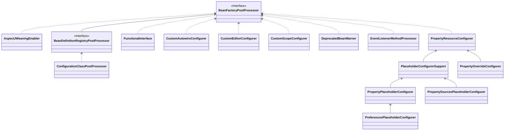

`new` 普通对象 → 依赖注入 → bean 初始化：`InitializingBean.afterPropertiesSet()` → bean 初始化后调用1： `BeanPostProcessor.postProcessBeforeInitialization()` → bean 初始化后调用1：`BeanPostProcessor.postProcessAfterInitialization` → bean 销毁前：`DisposableBean.destroy()`

## 初始化回调和销毁回调

### 实现接口（InitializingBean、DisposableBean）

### XML（init-method、destroy-method）

### 注解（@PostConstruct、@PreDestroy）

## BeanNameAware

BeanNameAware.setBeanName() 在 InitializingBean 之前被调用

## ApplicationContextAware

ApplicationContextAware.setApplicationContext() 在 BeanNameAware.setBeanName() 之后，在 InitializingBean 之前被调用

## Lifecycle、LifecycleProcessor、SmartLifecycle 接口

## BeanFactoryPostProcessor

### PropertySourcesPlaceholderConfigurer

### PropertyOverrideConfigurer

允许自定义修改应用程序上下文的 bean 定义，调整上下文底层 bean 工厂的 bean 属性值。在 bean 创建之前修改 bean 定义信息

[](https://mermaid.live/edit#pako:eNqVVctOwzAQ_BXLZ8oHVKgStEUCgagoUi--GHvTWkrW0douqqr-O5vSFyUvbol3Zjy7GcdbabwFOZQm1yFMnF6SLhRaR2Ci8ygePhTua-I-lLz2vAC9dricov7MgY7FB9A4gcyhq1jvsHQh0mbmQ5yRNxCCJ7FVeHf3hBEo0wZGI4UKd5cCj9pE_y_W2GPmlol0teu4WvpFPsFSiL64T9F_cWNHElzVp9bx9k3VufFlDXUCJY9KR7BVBwtNeK5N14DxhScBvPgKceXtH2uPCfeD1vmpx2NplvPLyucWLkzNU1l6iicMQQYEyKK18DOO3VPcvK2ByFloRvSSeYfgE5kWmfm-3mRKYW2ahLi9HYnmLCjskzMxGLSL1My82rmV05G0C-dd9lirIY7d7dcHtS_vKsLdtLpwd7PaYt_Nbkv94dM2p7Did5yIK416TCXTdGD6mWhTPwi0NXqWqNHvnmGPQ9jPhbyRBVChneU7gn_FQigZV1CAkkN-tJDplEcl-Z_M0FRaDstPPOUw03mAG6k55_MNGjmMlOAIOlw1P4u7b0faeyA)

## [自定义实例化逻辑 FactoryBean](https://docs.spring.io/spring-framework/docs/current/reference/html/core.html#beans-factory-extension-factorybean)
